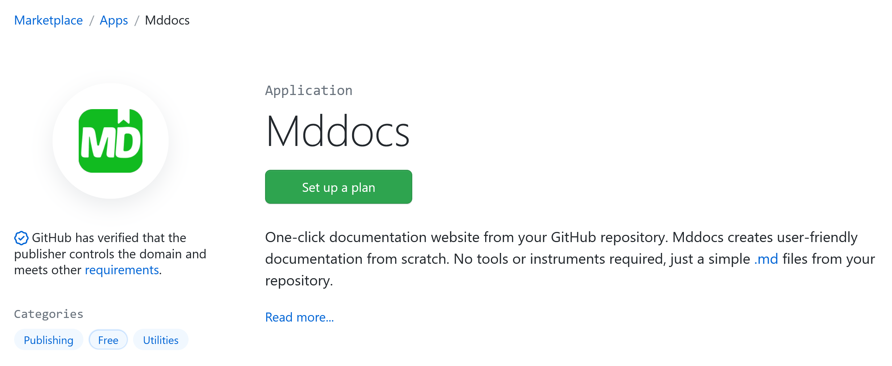
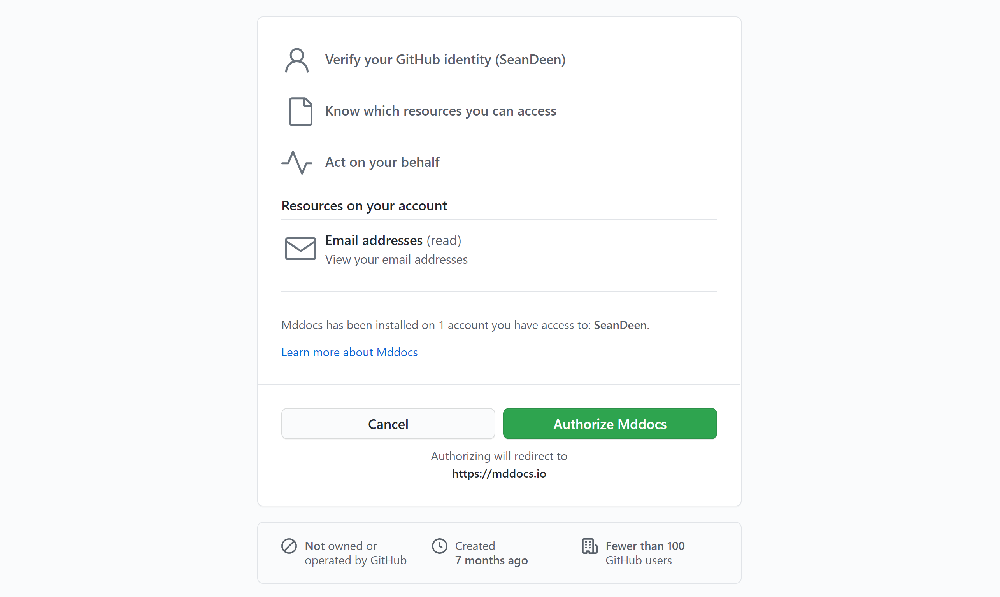
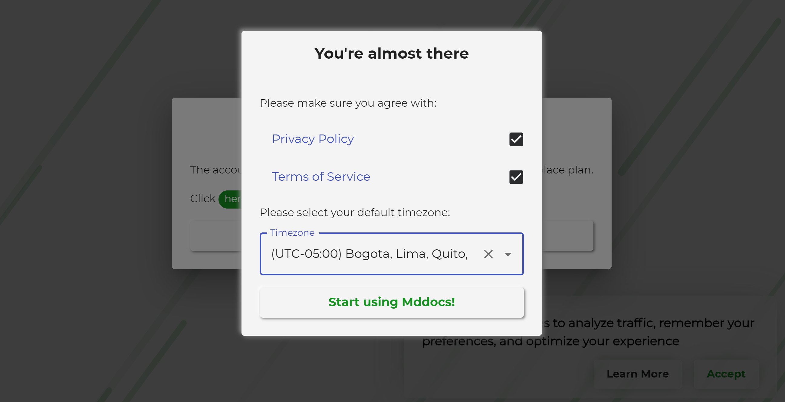

## Getting started

This is a short instruction describing how to start creating backups for your GitHub repositories.

### Installation

Follow these simple steps below to start using Mddocs. 

#### Set up a new plan from the GitHub Marketplace

Open Mddocs's page on the GitHub Marketplace by clicking on the [following link](https://github.com/marketplace/mddocs). 
Click on the `Set up a plan` button.

In the *Pricing and Setup* section select the account for which the Mddocs application will be installed and then click on the `Install it for free` button.

Review your order to make sure you've selected the correct plan and account. After that click on the `Complete order and begin installation`.

You will be redirected to the Mddocs application installation page. 

#### Install GitHub application

On the Mddocs installation page, select the repositories you want to backup by providing Mddocs the access to them. Click on the `Install` button.

Wait until you will be redirected to authorization page. Click on the `Authorize Mddocs` button:

You then will be redirected to the Mddocs Dashboard. 
Accept the Mddocs's Terms of Service and Privacy Policy by clicking on the corresponding checkboxes and click `Start using Mddocs!` button:

That's it, you now have completed the installation.

