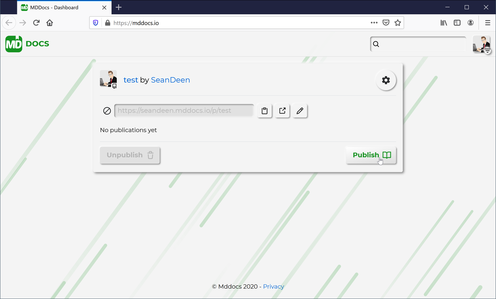
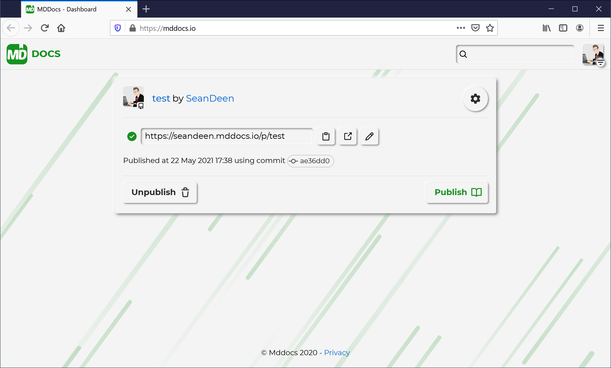
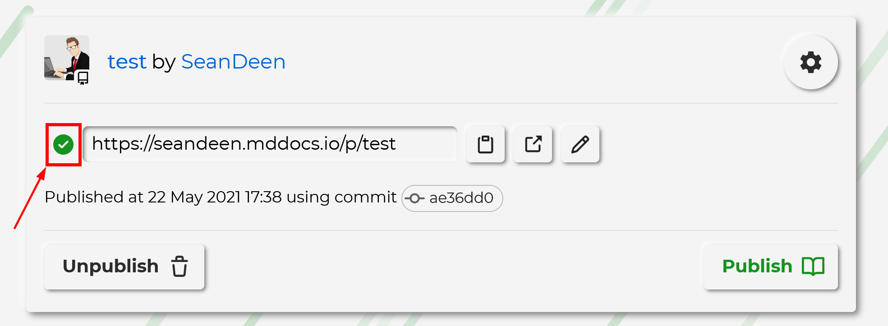
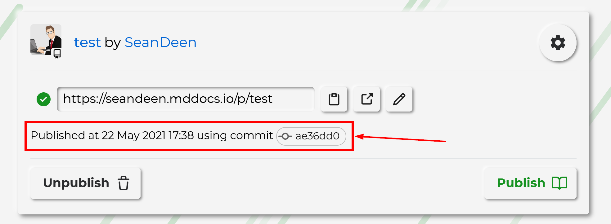
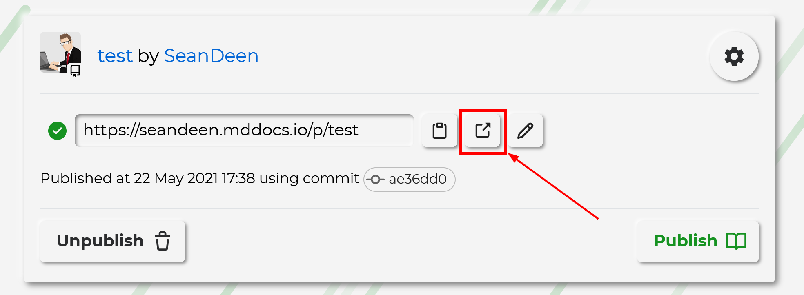

# Publish Markdown Documentation

Mddocs supports `.md` files as a source files for your documentation pages. By default Mddocs uses `index.md` file located in the documentation [source folder](./change_root_folder.md) to create `index.html` of you documentation website. If the file is missing, Mddocs application will look for the `README.md` file in the source folder of your repository.

## Prerequisites

We assume you have completed the following steps in advance:
 - There is a GtHub repository with markdown documentation 
 - Mddocs GitHub application is installed into your account
 - You provided Mddocs application an access to the repository in the [Installed GitHub App](https://github.com/settings/installations/) page

## Publish documentation website

In order to publish the documentation open [Mddocs Dashboard](https://mddocs.io) and find the card of the repository you want to publish. Click on the `Publish` button: 

Wait for publication status to become `Published`. This status means that the publication succeeded and the website is available for the users:

 Green check icon next to the repository Url represents the `Published` status:

Also, when the documentation is published, the status text is displayed on the repository card. The text displays the date and time of the publication as well as the link to the commit that was used for the publication. 

You can visit the generated website by clicking on the `External link` icon:

## See also

- [Publish static website](publish_static_website.md)
- [Make documentation private](make_docs_private.md)
- [Enable continuous deployment](continuous_deployment.md)
- [Change repository branch](change_branch.md)
- [Change repository folder](change_root_folder.md)
