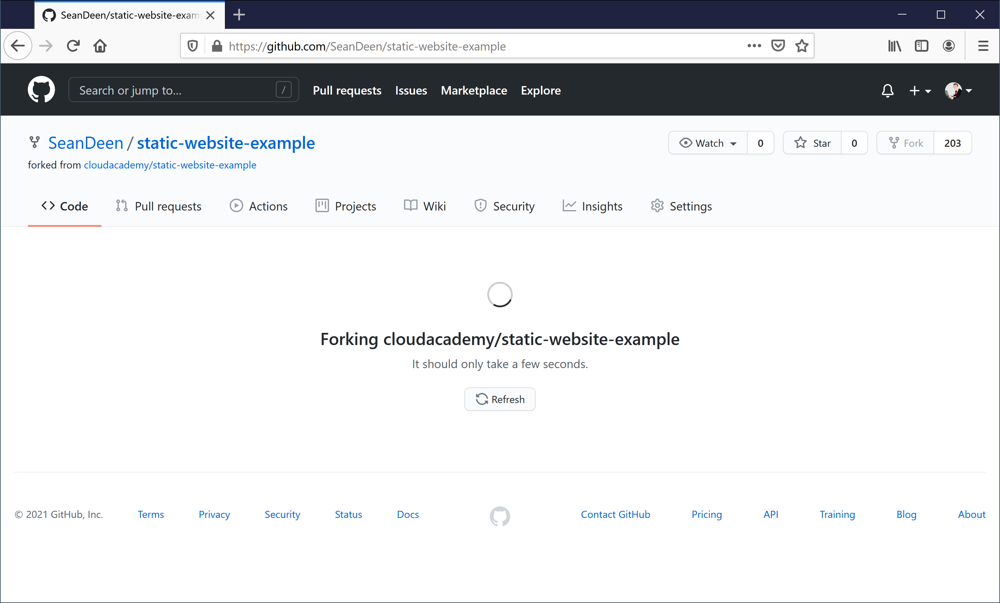
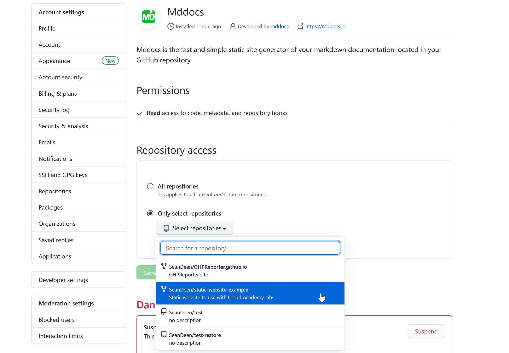
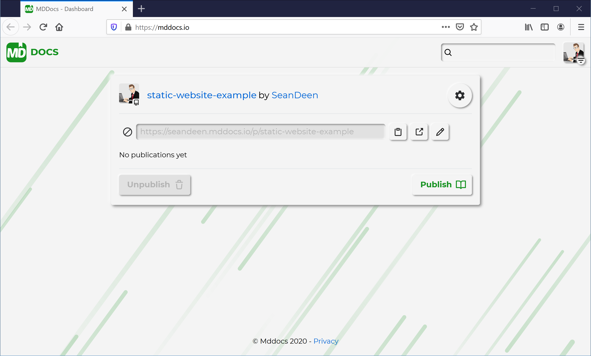
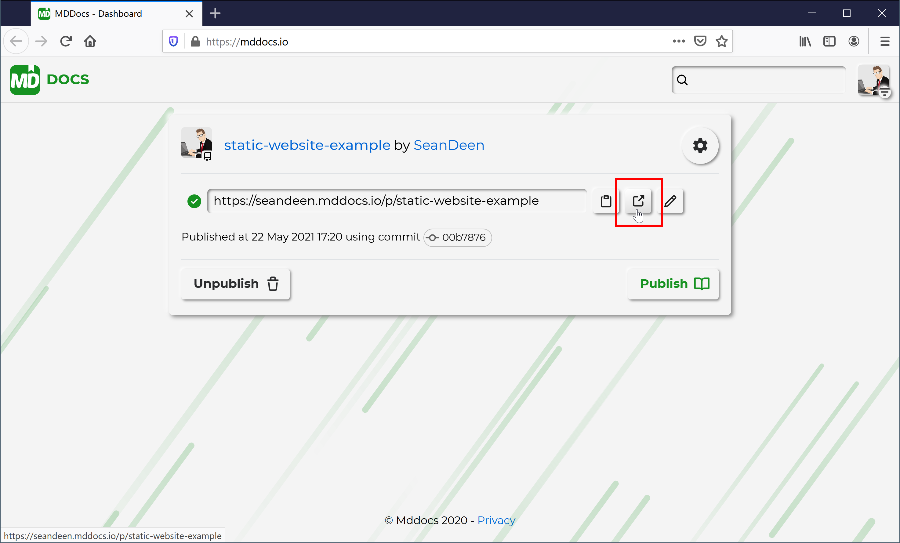

# Publish Static Website

It is possible to publish a regular static HTML-based website without a single [Markdown](https://en.wikipedia.org/wiki/Markdown) file at all. Just place your static website files into a GitHub repository and publish it using **mddocs**. 

It is similar to [GitHub Pages](https://pages.github.com/), but allows you to publish a website from an arbitrary repository and repository branch. GitHub Pages demands the repository to be named `<account>.github.io` and publishes only the main branch of the repository.

Let's publish a static website repository using the website example:

### 1. Fork example repository

[Cloud Academy](https://cloudacademy.com/) has published a good static website example that can be found in the [static-website-example](https://github.com/cloudacademy/static-website-example) repository. Let's fork it into our own repository: 



### 2. Grant an access to the repository

```Note: If the Mddocs GitHub Application has an access to `All repositories` there is no need to grant an access explicitly.```

Go to the [Installed GitHub Apps](https://github.com/settings/installations) page, find `Mddocs` installation, and grant an access to the forked repository:




### 3. Go to the mddocs.io and publish the repository

Once the access is granted a repository card will appear in the `mddocs` dashboard, please locate it and click `Publish`



### 4. Go to the published website

There is an `Open website` button, click it in order to open the published website in the new tab:



The static web site is published:


## See also

- [Make documentation private](make_docs_private.md)
- [Enable continuous deployment](continious_deployment.md)
- [Change repository branch](change_branch.md)
- [Change repository folder](change_root_folder.md)
